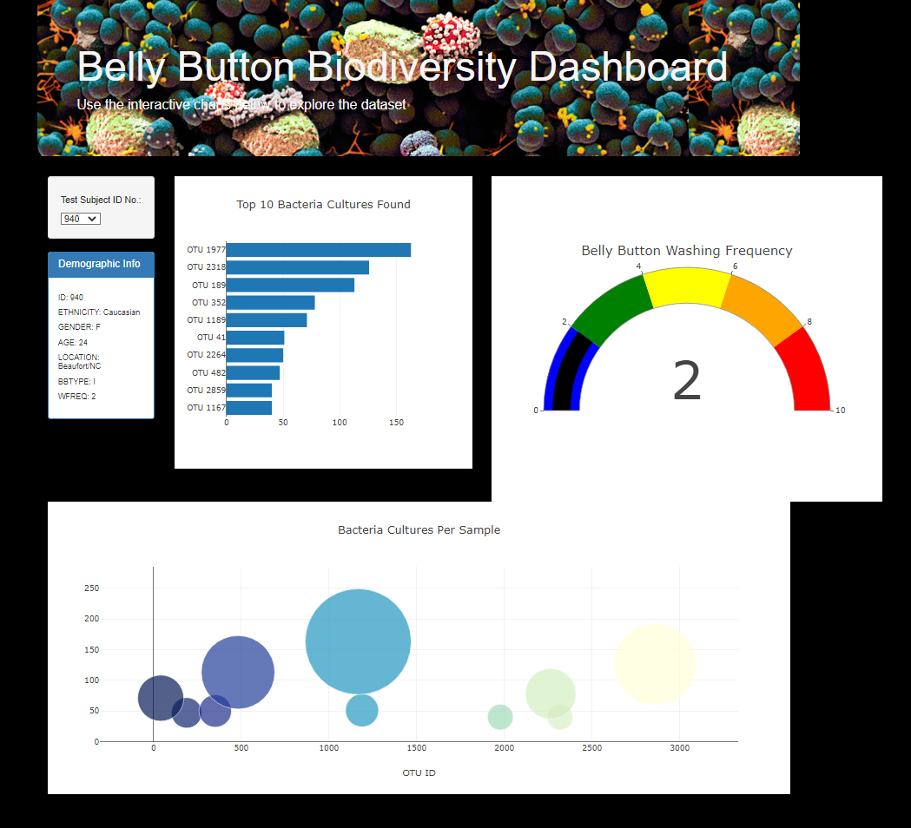

# Belly Button Biodiversity 

## Overview

The objective of this assignment is to create an interactive dashboard that allows the user to navigate the data regarding microbes living in belly buttons. 

## Features

1. Dropdown menu: The dropdown menu allows the user to choose individual subject ID's.
2. Demographic Info: Once a subject Id is chosen the demographic bar will display information about the subject.
3. Bar Chart: The bar chart will display the top 10 cultures found.
4. Gauge Bar: The gauge bar will display the frequency of belly button washes per week.
5. Bubble Chart: The bubble chart displays the bateria cultures.